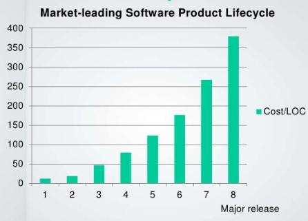
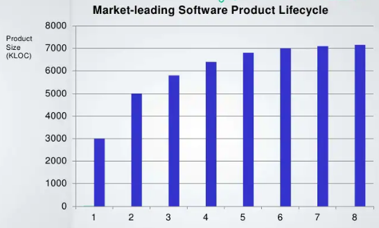
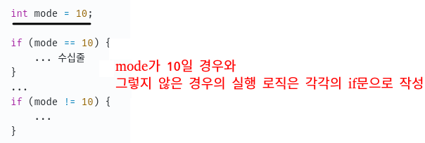
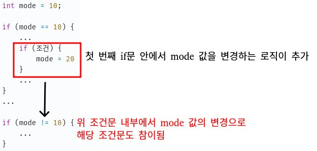
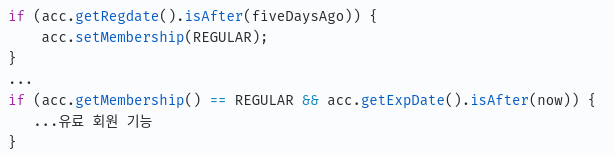
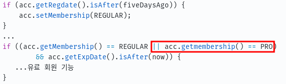

# 객체 지향 프로그래밍 입문
이 글은 [최범균님의 Inflearn 강의](https://www.inflearn.com/course/%EA%B0%9D%EC%B2%B4-%EC%A7%80%ED%96%A5-%ED%94%84%EB%A1%9C%EA%B7%B8%EB%9E%98%EB%B0%8D-%EC%9E%85%EB%AC%B8/dashboard) 를 학습한 내용을 정리하였습니다.

## 들어가며
처음 언어를 배우며 객체지향을 위한 특징(상속, 인터페이스, 클래스, 추상메소드 등)을 배운다.
하지만 입문 단계에서 동시에 객체 지향적으로 프로그래밍하는 것은 매우 어렵다.
이 강의를 통해서 객체 지향적으로 프로그래밍하기 위한 도움을 받아보자.

#### 내용
- 비용
- 객체
- **캡슐화**
- **다형성과 추상화**
- 상속보단 조립
- 기능과 책임 분리
- 의존과 DI
###### 특히 캡슐화와 추상화에 대해서 자세히 알아보도록 하겠다.

#### 선수 지식
- private, public 예약어에 대한 이해
- 클래스, 추상 클래스, 인터페이스의 차이점
- 추상 메서드
- 상속(extends, implements) 하는 방법
- 오버라이딩(재정의)

## 비용

|  *LOC: Lines of Code||
|---:|---|

출처: Slow and dirty with callouts

왼쪽에 있는 그래프를 해석해보면 X축은 출시 횟수, Y축(Vertical-bar)은 Cost(비용)을 LOC(코드 라인)으로 나눈 값(코드 한 줄을 추가하기 위한 비용)이다.
그래프를 보면 출시 횟수가 증가할 때 코드 한 줄을 추가하는 비용은 어마어마하게 커진다.

오른쪽의 그래프를 해석해보면 X축은 출시 횟수, Y축(Vertical-bar)은 전체 코드 라인 수이다.
코드 라인 수는 5번 출시 이후로 거의 증가되지 않는다.

두 그래프를 통해 전달하고자 하는 내용은 **출시 횟수가 늘어도 기능의 추가는 거의 없지만 코드 한 줄을 추가하기 위한 비용은 매우 크다**는 것이다.

그럼 이런 일이 발생하게 되는 이유가 뭘까?

### 단순한 예1.
프로젝트 핵심 로직들의 소요시간을 측정하는 코드를 통해서 알아보도록 하자.
##### mills 단위로 소요시간을 측정하는 코드
```java
// 소요시간 측정 (millis)
long start = System.currentTimeMillis();

...

long end = System.currentTimeMillis();
long elapsed = end - start;
``` 
프로젝트 초기에는 핵심 로직의 소요시간을 측정을 millis 단위로 하였지만 nano 단위로 변경해야되는 상황이 되었다.
그래서 위 코드에서 아래 코드로 시간을 측정하는 코드인 System.currentTimeMillis();를 System.nanoTime();으로 바꿔야한다.
##### nano 단위로 소요시간을 측정하는 코드
```java
// 소요시간 측정 (nano)
long start = System.nanoTime();

...

long end = System.nanoTime();
long elapsednano = end - start;
```
이때 소요시간을 측정하는 코드가 하나만 작성이 되어있다면 코드를 변경하는데 어려움이 없을 것이다.
하지만 보통 이런 종류의 코드들은 한 곳에만 있지 않은 경우가 많다.
이는 곧 변경을 위한 코드들을 찾는 시간이 증가하고 결과적으로 Cost/LOC이 증가하게 되는 상황이다.

### 단순한 예2.
조건으로 들어는 변수가 10인 경우와 10이 아닌 경우에 실행되는 로직이 달라야하는 코드를 통해서 알아보도록 하자.



시간이 지나 위 로직이 아래의 코드로 수정이 된다면



첫 번째 if문에서 mode 값이 변경되었고 아래의 조건문도 실행하는 결과로 이어진다.
~~애석하게도 mode가 10인 경우와 10이 아닌 경우를 검사하는 if문이 연속해서 작성된 경우가 아니라면 분명 이런 실수가 일어날 수 있을 것 같네요.~~
이는 mode가 10인 경우에 로직과 mode가 10이 아닌 경우의 로직도 실행하여 예상하지 못한 결과를 만들어 낼 것이고 디버깅을 하는데 시간이 소요될 것이다.
결과적으로 Cost/LOC이 증가하게 되는 상황이다.

### 단순한 예3.
if문에 조건을 추가하는 상황을 통해서 알아보도록 하자.



원래 사이트에는 Membership이 REGULAR 뿐이었지만 시간이 흘러 Membership으로 PRO가 추가되었다.
유료 회원의 사용 기능을 PRO Membership을 가진 회원들에게도 제공하기 위해 아래와 같이 변경이 필요하다.


\

이렇게 기능을 추가해되는 조건이 여러개가 있다면, 또 추가된 Membership이 여러가지라면 모든 조건을 다 찾아서 수정하려면 비용이 굉장히 클 것이다.

## 비용을 높이는 주요 원인
위 3가지 예를 통해서 시간이 흐를수록 **코드 한 줄을 추가 또는 수정**하기 위한 **비용이 증가하는 이유**를 크게 **2가지로 나눌 수 있을 것이다**.

1. 코드 분석 시간 증가
2. 코드 변경 시간 증가

## 비용과 변화
소프트웨어를 개발/유지보수하면서 뭔가를 변화시킬 때 고비용이 들어가면 경쟁력이 떨어지게 된다.
그렇기 때문에 저비용으로 변화시킬 수 있는 방법을 적용해야된다.

### 개발/유지보수를 용이하게 하는 방법

- 패러다임 적용
    - 객체 지향, 함수형, 리액티브
- 클린 코드 작성, 꼼꼼한 설계, 적절한 아키텍쳐 도입
    - DRY, TDD, SOLID, DDD
    - 클린 아키텍처, MSA
- 업무 프로세스/문화 개선
    - 애자일, DevOps

## 객체지향과 비용
객체 지향이 개발 비용을 줄여주는 방법으로 **캡슐화 + 다형성(추상화)**이 있다.
이 강의를 통해 구체적인 내용을 알아보도록 하자.