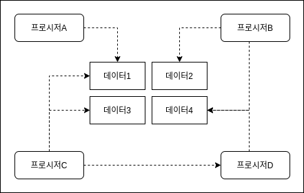
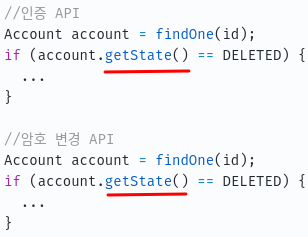
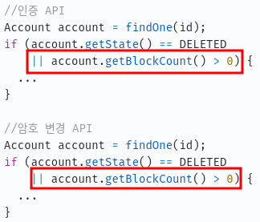
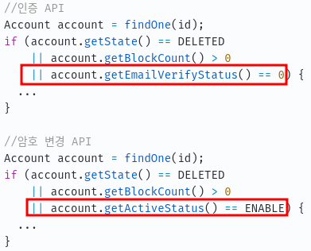
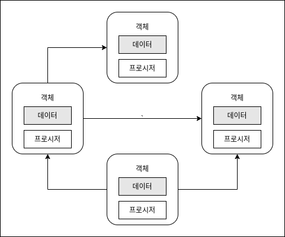
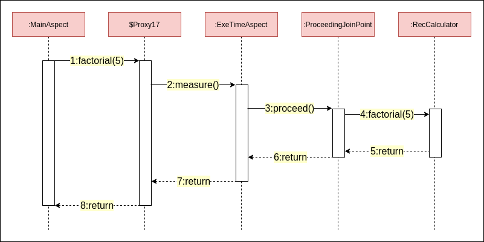

# 객체 지향 프로그래밍 입문
이 글은 [최범균님의 Inflearn 강의](https://www.inflearn.com/course/%EA%B0%9D%EC%B2%B4-%EC%A7%80%ED%96%A5-%ED%94%84%EB%A1%9C%EA%B7%B8%EB%9E%98%EB%B0%8D-%EC%9E%85%EB%AC%B8/dashboard)를 학습한 내용을 정리하였습니다.

## 절차 지향 vs 객체 지향
객체 지향을 설명할 때 절차 지향도 같이 나오는 것은 국룰이다.
여기서도 절차 지향에 대해서 알아보고 객체지향에 대해서 알아보도록 한다.

### 절차 지향
절차 지향은 **데이터를 여러 프로시저가 공유하는 방식**을 말한다.



위의 그림에서 데이터1을 프로시저A와 프로시저C가 공유를 하고 있고
데이터4를 프로시저B와 프로시저D가 같이 사용하고있다.

입문 단계에서 프로그램을 작성할 때 위와 같은 방식을 많이 사용한다.
하지만 데이터를 공유하는 방식은 로직이 추가될수록 구조를 점점 복잡하게 만들고 수정하기 힘들게 만드는 요인이 되기도 한다.

### 절차 지향과 비용
#### 예1.



위 코드에서 인증API와 암호 변경API 에서 account의 state를 직접 사용하고 있다.

시간이 흘러 요구사항이 인증API와 암호 변경API에서 blockCount의 횟수도 체크하도록 변경되었다.



시간이 더 흘러 요구사항 변경이 되었다.
이번에는 인증 API에서는 emailVerifyStatus도 체크하도록 변경되고
암호 변경 API에서는 activeStatus가 ENABLE인지 검사하도록 변경되었다.



이렇게 상태(필드)에 접근해서 조건을 추가하는 방식은 초기에는 쉽고 편할 수 있다.

하지만 위 코드에 작성된 인증API와 동일한 조건을 검사하는 로직과 암호 변경 API와 동일한 조건을 사용하는 로직이 많이 있고 (~~약 2000개 정도있다고 생각해보자~~)
account.getState()와 account.getBlockCount()의 account관련한 API에 기본적인 조건으로 적용해야된다면 모든 코드를 찾아서 수정하기에는 무척 힘들것이다. (~~그리고 복붙 코드가 많아진다.~~)


### 객체 지향

객체 지향은 **데이터와 프로시저를 객체 단위**로 묶는다.
그리고 특정 객체가 가지고 있는 데이터는 해당 객체의 프로시저만 접근할 수 있도록 한다. (~~물론 구현하기에 따라 필드를 public으로 두면 직접 접근가능하다.~~)



입문자가 객체 지향 프로그래밍이 어렵다고 느끼게하는 이유는 데이터와 프로시저를 적절하게 나눠서 객체로 묶는 것이 익숙하지 않기 때문일수도 있다.
이 부분은 캡슐화 강의에서 자세히 알아보도록 하겠다.

## 객체란

물리적인 관점에서 객체는 데이터와 프로시저의 묶음이다.
객체대 객체의 관점에서 객체는 기능 제공자이다.

#### 예1. 회원객체
- 암호 변경하기 기능
- 차단 여부 확인하기 기능

#### 예2. 소리 제어기 객체
- 소리 크기 증가하기 기능
- 소리 크기 감소하기 기능

## 기능 명세
> 기능 명세란 어떻게 사용하면 되는지 알려주는 것이다.

메서드(오퍼레이션)를 이용해서 기능 명세한다.
> 메서드는 이름, 파라미터, 결과로 구성되어있다.

###### Member.class

```java
public class Member {

  public void changePassword(String curPw, String newPw) {
    ...
  }
}
```

###### VolumnController.class

```java
public class VolumnController {
  public void increase(int inc) {
    ...
  }
  
  public void decrease(int dec) {
    ...
  }
  
  public int volume() {
    ...
  }
}
```

## 객체의 협력
객체와 객체는 기능을 사용해서 협력한다.
이때 기능을 사용한다는 말은 메서드를 호출한다는 의미이다.

######
```java
VolumnController volCont = new VolumnController();
volCont.increase(4);
volCont.decrease(3);

int currentVol = volCont.volume();
```

## 메시지란
객체와 객체가 상호작용하는 것을 메시지를 주고 받는다고 표현한다.
메서드를 호출하는 메시지, 리턴하는 메시지, 익셉션 메시지



위 그림에서 빨간색 박스는 객체, 노란색 박스는 메세지이다.
예를들어 2:measure()는 호출하는 메시지이고 8:return은 리턴하는 메시지이다.

## 이건 객체라고 할 수 있을까?
```java
public class Member {
  private String name;
  private String id;
  
  public void setName(String name) { this.name = name; }
  public String getName() { return name; }
  public void setId(String id) { this.id = id; }
  public String getId() { return id; }
}
```

이렇게 단순하게 데이터만 조작하는 객체는 객체라기 보다는 데이터 클래스라는 식으로 표현한다.