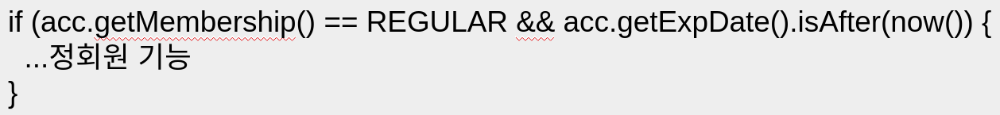
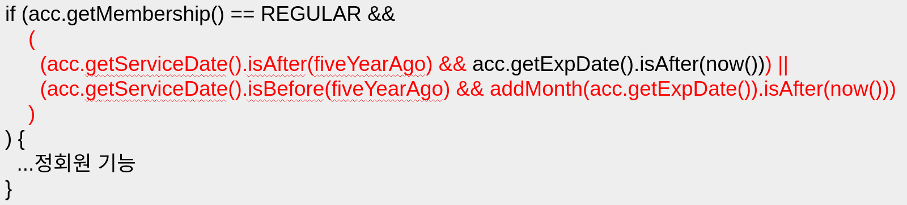

# 객체 지향 프로그래밍 입문
이 글은 [최범균님의 Inflearn 강의](https://www.inflearn.com/course/%EA%B0%9D%EC%B2%B4-%EC%A7%80%ED%96%A5-%ED%94%84%EB%A1%9C%EA%B7%B8%EB%9E%98%EB%B0%8D-%EC%9E%85%EB%AC%B8/dashboard)를 학습한 내용을 정리하였습니다.

## 캡슐화란?
캡슐화(Encapsulation)는 **데이터 + 관련 기능을 묶는 것**이다.
캡슐화하면 객체가 기능을 어떻게 구현했는지 외부에서는 알 수 없다.
조금 내용을 덧붙이면 실제 구현에 사용된 데이터가 어떤 타입인지 그 데이터 값을 어떻게 사용하는지 등에 대한 것은 외부에서 알 수 없다.

### 캡슐화와 정보 은닉
언제부터였는지 모르지만 최근에는 캡슐화에 정보 은닉(Information Hiding)을 포함시킨 개념으로 사용한다.
(~~캡슐화와 정보 은닉에 대한 수업을 듣던 중 다른 것 같지만 같은거아니야 했었던 기억이 난다.~~)

### 캡슐화를 하는 이유
외부에 영향없이 객체 내부 구현을 변경 가능하도록 해준다.

#### 예. 캡슐화하지 않으면

위 코드는 회원의 membership이 REGULAR이면서 회원의 만료일이 현재 시간 이후라면 (만료일이 지나지 않았다면) 정회원의 기능을 실행하는 코드입니다.

시간이 무려 7년이나 흘러 (~~이번에도 시간이 흘렀습니다.~~) 5년이상 서비스를 이용한 회원에게 정회원 혜택 1개월 무상 제공을 하게되었다.
이벤트를 위해 정회원 기능을 수행하는 조건문을 아래와 같이 변경하였다.

기존 조건에서 memberShip과 expDate로 정회원 기능 수행 여부를 판단했다면
추가로 ServiceDate의 값을 사용하면서 ServiceDate의 값에 따라서 expDate를 사용하는 방식도 바뀌게 되었다.
이와 같은 조건(정회원 기능을 실행하는 로직)에 해당하는 모든 코드를 찾아서 수정해야한다.

위 상황을 그림으로 표현하면 아래와 같다.

요구사항 변경의 예
- 장기 사용자에게 특정 기능 실행 권한을 연장 (단, 유효 일자는 그대로 유지)
- 계정을 차단하면 모든 실행 권한이 없음
- Date를 LocalDateTime으로 변경

#### 예. 캡슐화하면

> 캡슐화는 **데이터와 관련 기능을 묶는 것**이다. 그리고 캡슐화를 하면 외부로부터 기능 구현을 감추게된다.

membership, expDate 그리고 정회원인지 검사하는 기능을 하나의 객체로 묶었다.
코드는 아래와 같다.

그리고 기존의 조건문은 hasRegularPermission()을 호출하기만 하면 된다.
코드는 아래와 같이 수정된다.

이렇게 캡슐화를 이용하였을 때 요구사항이 변경된다면
Account의 hasRegularPermission()의 내부 구현을 바꿔준다.

내부 구현은 바뀌었지만 hasRegularPermission()을 사용하는 코드는 바뀌지 않는다.

즉, 캡슐화를 잘해두면 요구사항이 변해도 코드가 변경되는 부분을 최소화할 수 있다.

### 캡슐화를 위한 규칙

1. Tell, Don't Ask (데이터를 달라하지 말고 해달라고 하기)

왼쪽 코드의 경우 membership의 값을 가져와서 조건을 판단한다.
이렇게 하는 것보단 오른쪽 코드처럼 membership을 가지고 있는 객체에 처리를 맡기라는 규칙이다.

2. Demeter's Law
    - 메서드에서 생성한 객체의 메서드만 호출
    - 파라미터로 받은 객체의 메서드만 호출
    - 필드로 참조하는 객체의 메서드만 호출

왼쪽의 코드와 같이 .(method chaining)방식을 사용하는 것보단 오른쪽과 같이 메서드를 호출하는 객체의 메서드로 끝내라는 규칙이다.

> Demeter's Law에 대한 참고 블로그입니다.  
> [망나니 개발자님의 [OOP] 디미터의 법칙(Law of Demeter)](https://mangkyu.tistory.com/147)  
> [기계인간 johngrib님의 디미터 법칙의 오해](https://johngrib.github.io/wiki/law-of-demeter/#%EC%A3%BC%EC%9D%98-%EB%94%94%EB%AF%B8%ED%84%B0-%EB%B2%95%EC%B9%99%EC%9D%80-%ED%95%98%EB%82%98%EC%9D%98--%EC%9D%84-%EA%B0%95%EC%A0%9C%ED%95%98%EB%8A%94-%EA%B7%9C%EC%B9%99%EC%9D%B4-%EC%95%84%EB%8B%88%EB%8B%A4)  
